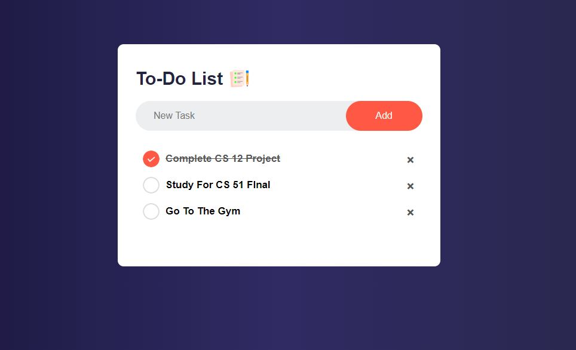

# To-Do List 

 **Technologies:**
  - HTML, CSS, and Javascript

**Features:** 
  - Allows the user to create tasks
  - Mark tasks completed by clicking on them
      - This will check the circle and draw a line through the task
  - Delete tasks from the list by clicking on the "X" 
  - Saves the users To-Do list despite browser closure or refresh

# Example

